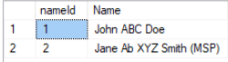
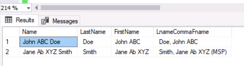

Given a table 'Names' with a 'Name' column:



This query will output the desired pattern **Lname, Fname (MSP)**  where (MSP) may or may not exist in the field.


```sql

WITH Q1 AS(
  SELECT 
    CHARINDEX('(', Name) as LocParenthesis, 
    CASE WHEN CHARINDEX('(', Name) > 0 THEN SUBSTRING(
      Name, 
      1, 
      CHARINDEX('(', Name)-2
    ) ELSE Name
    END AS Name, 
    CASE WHEN CHARINDEX('(', Name) > 0 THEN SUBSTRING(
      Name, 
      CHARINDEX('(', Name), 
      LEN(Name)- CHARINDEX('(', Name)+ 2
    ) ELSE '' END AS MSP
    FROM Names
), 
Q2 AS(
  SELECT 
    Name, 
    MSP, 
    LEN(Name) as LenName, 
    REVERSE(Name) as ReverseName, 
    CHARINDEX(
      ' ', 
      REVERSE(Name)
    ) LocSpaceReverseName, 
    LEN(Name) - CHARINDEX(
      ' ', 
      REVERSE(Name)
    )+ 1 AS LocLastSpace
    FROM Q1
), 
Q3 AS(
  SELECT Name, 
  SUBSTRING(
    Name, LocLastSpace, LenName - LocLastSpace + 1
  ) AS LastName, 
  SUBSTRING(Name, 1, LocLastSpace) AS FirstName, 
  SUBSTRING(
    Name, LocLastSpace, LenName - LocLastSpace + 1
  ) + ', ' + SUBSTRING(Name, 1, LocLastSpace)+ MSP As LnameCommaFname
  FROM Q2
) 
SELECT 
  * 
FROM 
  Q3

```


This query result:

